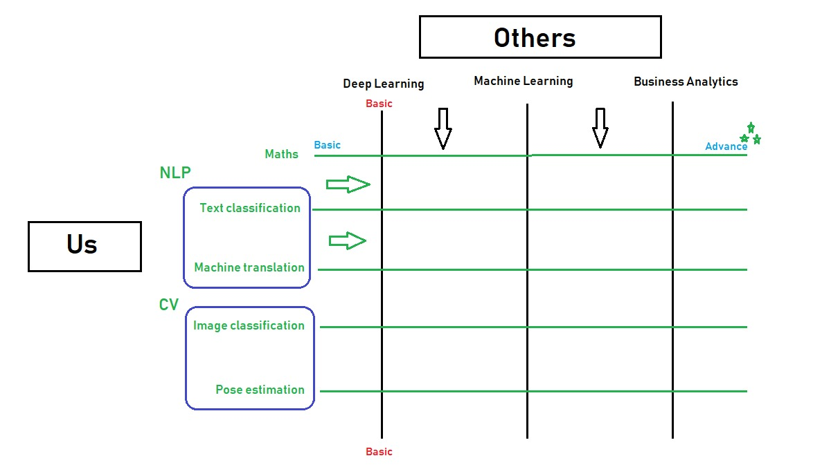

# Co-Learning Lounge

**Welcome to the one-point community-driven encyclopedia for anything in technology where we are transforming global education with help of collaborative learning.**

Forget fancy blogs with just disorganised articles or full-fledged courses with just basics thrown at you every next day, Here content is created and consumed by the community.

Artificial Intelligence, Block-chain, Automation or anything tech: we breakdown the buzzwords here together as a community where you can co-learn, collaborate, mentor or get mentored, innovate and grow.

---

##  Why Co-learning Lounge ?

When every other learning community you join is a place where people spam about themselves, their work, events, what better can you visualise? (The engagement astonishes me the most.)

The major problem with 99% of the online or offline communities is that they don’t really ensure a safe and secure place for elites to share their knowledge and expertise with young and passionate mind. It’s pretty simple, You don’t feel like home.

##  Our Motive towards society ?

We always learn from experience and experienced people. What better place than group of like-minded people? We believe that great community can bring the great content hence **great learning** compared to all expensive or not so expensive full-fledged courses which stick to basics. While every other course is technology specific and only get starts you. Here we completely focus on use case specific project centric approach where you learn from basics to advance.

Visit our learning unit [here](https://www.facebook.com/groups/colearninglounge/learning_content/) to start your learnings.

##  Our vision ?

As most of us can’t afford expensive courses or leave full time job to attend the school. Hence, we want to bring power back to you by creating content through community contribution which is free, self-paced with full-fledged community support.

##  How co-learning lounge can help to upskill and grow ?

**Co-learning lounge** is not a community, it’s a family of mentors and mentees.
Here our community members share their knowledge where the content is created and consumed by community with right mentorship. We also help each other in solving doubts. Not just it we also help each other getting job through reference. Here you will find your learning buddy, team member for your next hackathon and friend for lifetime 😊

##  What to expect ?

Join us with greediness to learn, passionate to help and resolute to grow.

## Want to become superhuman ?

It doesn’t matter whether you help to solve someone’s doubt or create nice informative tutorial for the community. Anything and everything is welcome.
Check our [what you can contribute guide](what_you_can_contribute.md) for more.

Right now, this is very much a self-funded initiative. If you wish to see more and more high-quality content, then support us by giving star to the repo and sharing with your friends and colleagues.

---

## Where do we live ?

Facebook is my home. Join us [here](https://www.facebook.com/groups/colearninglounge/) and be part of our family. Also like, follow and share our [FB page](https://www.facebook.com/Co-learning-lounge-2312708655617417).

## Technology

* [Tutorials](./Technology/Artificial%20Intelligence) ✍️

* Interview Questions - [machine learning](https://github.com/colearninglounge/co-learning-lounge/blob/master/Technology/Artificial%20Intelligence/interview_questions_machine_learning.md) - [deep learning](https://github.com/colearninglounge/co-learning-lounge/blob/master/Technology/Artificial%20Intelligence/interview_questions_deep_learning.md) 📚📚

* [List of A.I Companies](./Technology/Artificial%20Intelligence/companies.md) 🈺 

## Language

Python :

* [Tutorials](./Language/Python) ✍️ 
* [Interview Questions](./Language/Python/interview_questions.md) 📚📚
