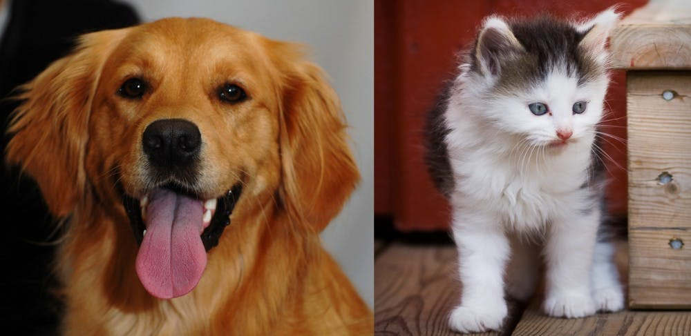

# CATS VS DOGS RECOGNIZER USING KERAS

Have you ever wondered how to classify images of cats and dogs using transfer learning. 

## Problem Statement

We need to predict the labels for the images of cats and dogs using transfer learning with the help of Keras framework.

