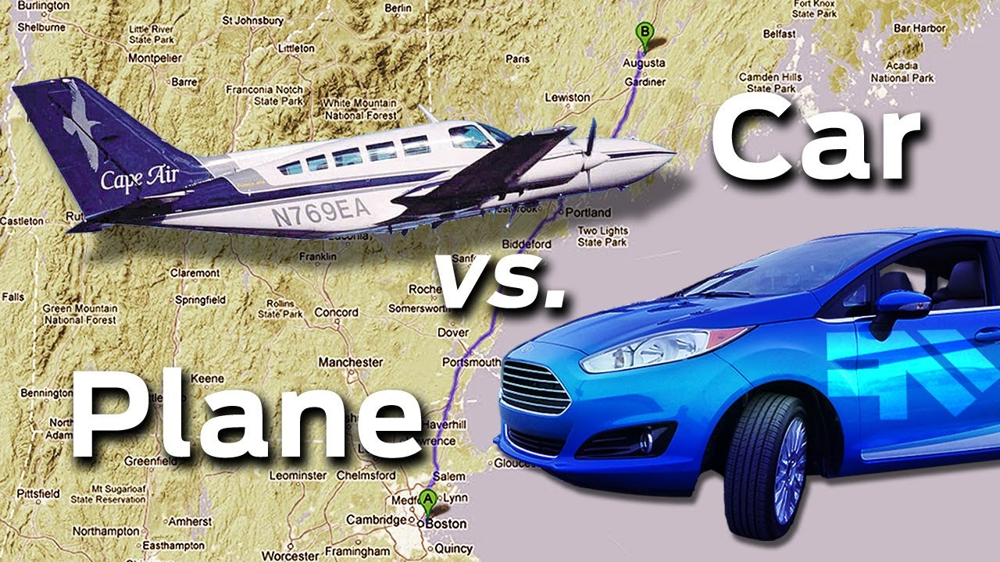

# CARS VS PLANES RECOGNIZER USING KERAS

Have you ever wondered how to classify images of cars and planes using transfer learning. 

## Problem Statement

We need to predict the labels for the images of cara and planes using transfer learning with the help of Keras framework.

