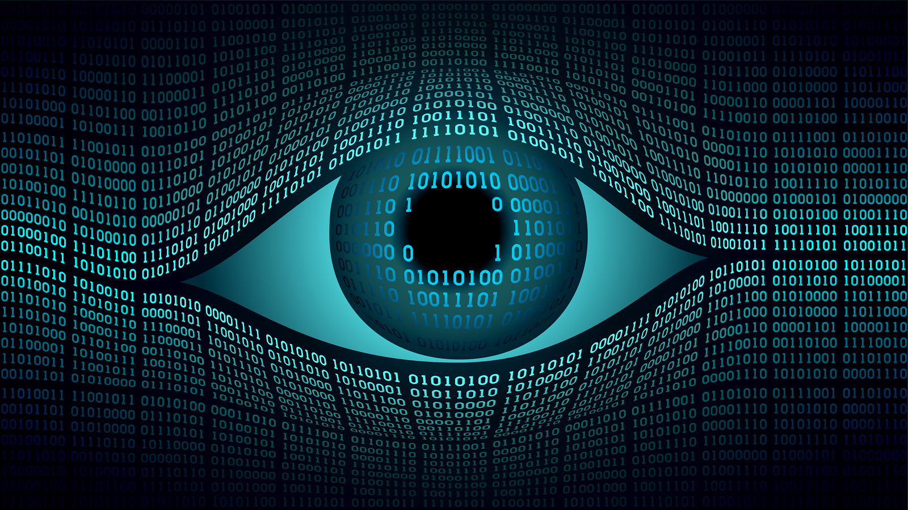

# Computer Vision

Give your computer the vision you have.

## What to expect?

This repo will help you to become zero to hero in Computer Vision.

## Quick Links

- [Books](#books)
- [Online Courses](#online-course)
- [Blogs to follow](#blogs-to-follow)
- [Popular Channels for Computer Vision](#popular-channels-for-computer-vision)
- [Concepts](#concepts)

## Books

- [Introduction to Statistical Learning](https://www-bcf.usc.edu/~gareth/ISL/ISLR%20Seventh%20Printing.pdf)
- [Computer Vision: Algorithms and Applications](http://szeliski.org/Book/)
- [Computer Vision : A Modern Approach By David A. Forsyth, Jean Ponce](http://cmuems.com/excap/readings/forsyth-ponce-computer-vision-a-modern-approach.pdf)
- [Multiple View Geometry in Computer Vision By Richard Hartley, Andrew Zisserman](http://books.google.com/books?hl=en&lr=&id=si3R3Pfa98QC&oi=fnd&pg=PR11&dq=computer+vision&ots=aQo-nw6e4Q&sig=zGRDslfuKd1ytlZWwTaTKcuLdNw)
- [Practical Python and OpenCV + Case Studies](https://github.com/Shivanandroy/Study-Materials/blob/master/Practical%20Python%20and%20OpenCV%2C%203rd%20Edition.pdf)
- [Computer Vision: Models, Learning, and Inference](https://web.itu.edu.tr/hulyayalcin/Signal_Processing_Books/2010_Szeliski_ComputerVision.pdf)
- [Machine Learning For Dummies Hands On Machine Learning with Scikit Learn and TensorFlow](https://github.com/yanshengjia/ml-road/blob/master/resources/Hands%20On%20Machine%20Learning%20with%20Scikit%20Learn%20and%20TensorFlow.pdf)

## Online Courses

- [Deep Learning by NPTEL](https://nptel.ac.in/courses/106106184/)
- [A friendly introduction to Convolutional Neural Networks and Image Recognition](https://www.youtube.com/watch?v=2-Ol7ZB0MmU)
- [Convolutional Neural Networks](https://www.coursera.org/learn/convolutional-neural-networks)
- [Collection | Convolutional Neural Networks for Visual Recognition (Spring 2017)](https://www.youtube.com/watch?v=vT1JzLTH4G4&list=PL3FW7Lu3i5JvHM8ljYj-zLfQRF3EO8sYv)
- [Udemy - Deep Learning and Computer Vision A-Z™ OpenCV, SSD & GANs](https://www.udemy.com/course/computer-vision-a-z/)
- [Deep Learning : Advanced Computer Vision](https://www.udemy.com/advanced-computer-vision/?src=sac&kw=deep%20learning%3A%20advanced)

## Blogs to follow
[Tombone's Computer Vision Blog](http://www.computervisionblog.com/)

## Popular channels for Computer vision
- [PyImage](https://www.pyimagesearch.com/)
- [Real Python](https://realpython.com/tutorials/computer-vision/)
- [Machine Learning Mastery](https://machinelearningmastery.com/what-is-computer-vision/)
- [Pythonprogramming.net](https://pythonprogramming.net/search/?q=opencv)

## Concepts

- Prerequisite :

  - Working knowledge of python.
  - Basic experience with [Numpy](https://colab.research.google.com/github/GokuMohandas/practicalAI/blob/master/notebooks/02_NumPy.ipynb).

- What Is Computer Vision?

  Computer vision is a field of study focused on the problem of helping computers to see.

- Challenges of Computer Vision

    - One reason is that we don’t have a strong grasp of how human vision works.
    - Studying biological vision requires an understanding of the perception organs like the eyes, as well as the                 interpretation of the perception within the brain.
    - A given object may be seen from any direction, in any lighting conditions, with any type of occlusion from other             objects, and so on. A true vision system must be able to “see” in any of an infinite number of scenes and still be           able to extract something meaningful.
    
- Popular Applications
    - Object Classification: What broad category of object is in this photograph?
    - Object Identification: Which type of a given object is in this photograph?
    - Object Verification: Is the object in the photograph?
    - Object Detection: Where are the objects in the photograph?
    - Object Landmark Detection: What are the key points for the object in the photograph?
    - Object Segmentation: What pixels belong to the object in the image?
    - Object Recognition: What objects are in this photograph and where are they?

- Projects

