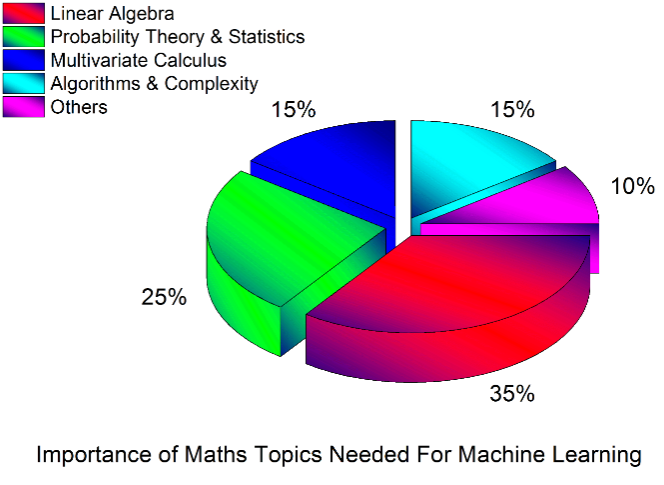

# Linear Algebra for Beginners

> Linear Algebra is a part of Mathematics and called as the back bone of Machine Learning, since each and every algorithm was engineered on top of notations with originated formulas.

It’s a good practice to comprehend the mathematical perception in the algorithms.

- In Machine Learning nearly 35% of space was equipped with **Linear Algebra**.

 
## What to expect?

This repository will help you to understand **Linear Algebra** from roots for beginners Levels.

## Quick Links

-  [Understanding Notations](#understanding-notations)
-  [Books](#books)
-  [Videos](#videos)
-  [Online Concepts](#online-concepts)
-  [Cheat Sheets](#cheat-sheets)

## Understanding Notations

-  [List of mathematical symbols by subject](https://en.wikipedia.org/wiki/List_of_mathematical_symbols_by_subject)
-  [Mathematical operators and symbols in Unicode](https://en.wikipedia.org/wiki/Mathematical_operators_and_symbols_in_Unicode)
-  [Mathematical and scientific symbols](http://www.uefap.com/speaking/symbols/symbols.htm)
-  [Mathematical Notation](https://sebastianraschka.com/pdf/books/dlb/appendix_a_math_notation.pdf)
  
## Books

- [Linear Algebra For Dummies](https://www.amazon.com/Linear-Algebra-Dummies-Mary-Sterling/dp/0470430907)
- [Pure Mathematics for Beginners](https://www.amazon.com/Pure-Mathematics-Beginners-Rigorous-Introduction/dp/0999811754/ref=sr_1_1?keywords=Pure-Mathematics-Beginners-Rigorous-Introduction&qid=1560841701&s=books&sr=1-1)
- [Algebra Basics](https://sebastianraschka.com/pdf/books/dlb/appendix_b_algebra.pdf)
- [Mathematics for Machine Learning](https://gwthomas.github.io/docs/math4ml.pdf)
- [Linear Algebra for Beginners Open Doors to Great Careers](https://www.amazon.com/Linear-Algebra-Beginners-Doors-Careers/dp/1728883407?tag=uuid10-20)
  
## Videos

-  [Essence of Linear Algebra | 3blue1brown ](https://www.youtube.com/watch?v=fNk_zzaMoSs&list=PLZHQObOWTQDPD3MizzM2xVFitgF8hE_ab)
-  [Linear Algebra | Khan Academy](https://www.khanacademy.org/math/linear-algebra)
-  [Computational Linear Algebra | fast.ai](https://www.youtube.com/playlist?list=PLtmWHNX-gukIc92m1K0P6bIOnZb-mg0hY)

## Online Concepts

- [How much mathematics does an IT engineer need to learn to get into data science/machine learning?](https://towardsdatascience.com/how-much-maths-does-an-it-engineer-need-to-learn-to-get-into-data-science-machine-learning-7d6a42f79516)
- [Essential Math Skills for Machine Learning](https://medium.com/towards-artificial-intelligence/4-math-skills-for-machine-learning-12bfbc959c92)
- [Machine Learning Math Essentials](https://courses.washington.edu/css490/2012.Winter/lecture_slides/02_math_essentials.pdf)
- [Linear Algebra Basics]( https://medium.com/@rathi.ankit/linear-algebra-for-data-science-a9648b9daee0)
- [A comprehensive beginners guide to Linear Algebra for Data Scientists]( https://www.analyticsvidhya.com/blog/2017/05/comprehensive-guide-to-linear-algebra/)
- [Boost your data science skills. Learn linear algebra]( https://towardsdatascience.com/boost-your-data-sciences-skills-learn-linear-algebra-2c30fdd008cf)
- [Linear Algebra 101 — Part 1](https://medium.com/sho-jp/towards-understanding-linear-algebra-part-1-d43710535503)
- [Linear Algebra 101 — Part 2](https://medium.com/sho-jp/towards-understanding-linear-algebra-part-2-e51c948ad00)
- [Linear Algebra 101 — Part 3](https://medium.com/sho-jp/towards-understanding-linear-algebra-part-3-5bda805bd67e)
- [Linear Algebra 101 — Part 4](https://medium.com/sho-jp/linear-algebra-101-part-4-6864630842b)
- [Linear Algebra 101 — Part 5](https://medium.com/sho-jp/linear-algebra-101-part-5-determinants-b54f990782cc)
- [Machine Learning & Linear Algebra](https://medium.com/@jonathan_hui/machine-learning-linear-algebra-a5b1658f0151)

## Cheat Sheets

- [Linear Algebra For Dummies Cheat Sheet](https://www.dummies.com/education/math/algebra/linear-algebra-for-dummies-cheat-sheet/)
- [Linear algebra explained in four pages](https://www.souravsengupta.com/cds2016/lectures/Savov_Notes.pdf)
- [Math 54 Cheat Sheet](https://math.berkeley.edu/~peyam/Math54Fa11/Cheat%20Sheets/Cheat%20Sheet%20(tiny%20font,%20no%20margins).pdf)
 
 
