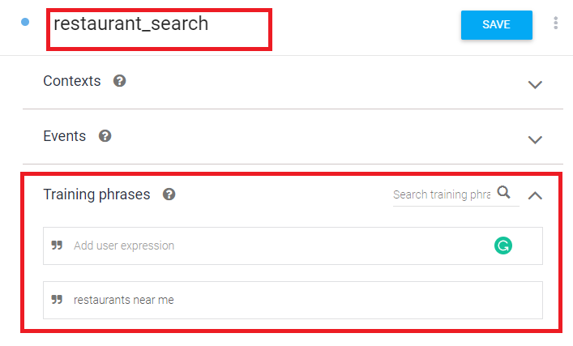
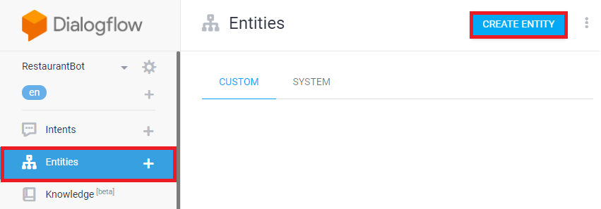
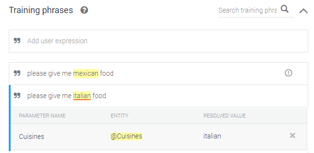
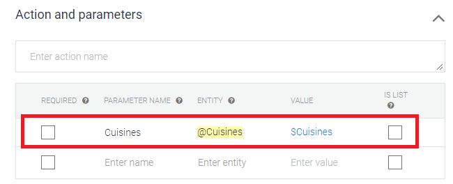
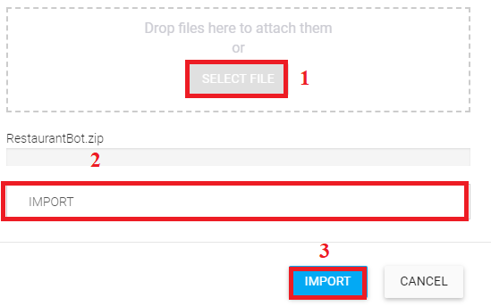

# Step 2: Conversation Design in Dialogflow

* [Create Agent]()
* [Create Intent]()
* [Create Entities]()
* [Final Step]()

## Create Agent

1.	Go to Dialogflow Console and sign in
2.	On your left pane you should be able to see **Create Agent**. Click on it and on the new page should open.

  

3.	Provide a name to the bot **Restaurant Bot**.

  

Dialogflow created a project on GCP for you to access logs and connect cloud functions for fulfilment. Once done click on **Create**.
4.	Two intents are created by default. **Default Welcome Intent** (this helps to greet users) and **Default Fallback Intent** (helps catch user queries that the bot cannot recognize an intent for). 

## Create Intents

1.	Now lets head to the intents section by click on **Intents** from the left panel to create intents.
2.	To create an intent, click on **Create Intent** button.
 

  

3.	Name the intent as **restaurant_search** and let’s skip to the **Training Phrase** section.
 

  

4.	Enter all the training phrases you can think of in this section for training the chatbot.
**Example**: 
•	Restaurants near me
•	I need a list of restaurants near me
•	List of restaurants around here
5.	Head to the bottom of the screen to enable Fulfillments.
 

  

* Click on the toggle button to **Enable Webhook call for this intent**. Remember to do this for all the intents in your agent. The reason Dialogflow has kept it this way is because there are times when a user would want to keep responses for a few intents within Dialogflow and for other to use fulfilments.
* If your intent uses entities and you would like to handle them with your fulfilments instead of within Dialogflow UI. Click the toggle button which is in front of **Enable webhook call for slot filling**.

## Create Entity

1.	Now let’s head to the entities section by click on **Entities** from the left panel to create entities.
2.	To create entities, click on **Create Entity** button.

  

3.	Name the entity as ‘**Cuisines**’ and add all the entity values. Remember to add all the synonyms for each value. In this case you can also enable **Fuzzy matching** by clicking on the checkbox. 

  

* Fuzzy matching is used to match entities in user queries. This usually helps when there are spelling errors or partial matches. 
* Regexp as the name states helps in matching a specific pattern in a user query. It uses Google RE2 Regular Expressions.

**Example**: 
**Invoice Number**: Dec/18-19/278
**Pattern**: [A-Z]{1,3}/[0-9]{1,2}-[0-9]{1,2}/[0-9]{1,3} 

4.	As you are putting the training phrases, you will see "**cuisines**" are automatically identified. 

  

5.	Once an entity has been recognized it appears in the **Actions and Parameters** section.

  

If you would like to handle entities within Dialogflow UI you can click on **Required** checkbox. This will ensure that when an intent matches with the user query, if the entity isn’t present in the query the agent requests the user to enter the entity before continuing to the next step. In this case, we will be handling the entity in fulfilment.
 
### Now download the agent and import it into Dialogflow.

  

1.	Click on **Setting** icon. 
2.	Then click on **Export and Import** tab
3.	Now click on **Import From Zip**. In the popup that opens click on **Select File** and import the downloaded zip file.
4.	Once you select the file type IMPORT in the text box.

  

Click on **Import** button to import all the entities and intents. Now your Agent is all set for the next step. Before heading towards the next step go through the intents created. 
