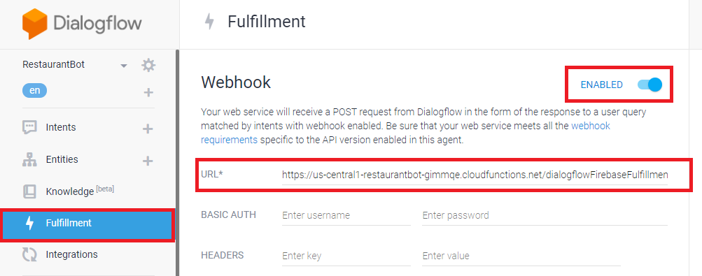

# Step 3: Firebase Fulfilment

[Fulfilment](https://cloud.google.com/dialogflow/docs/fulfillment-overview) provide an interface for users to create business logic and perform certain operations (like API calls, database interactions) to full fill an action. In the development we will be using Firebase Fulfilment. There are certain [limitations](https://cloud.google.com/dialogflow/docs/fulfillment-configure#limitations) due to with we can’t use inline editor in this bot.

1.	Create a folder named ‘Restaurant Bot’
2.	Open command line and go to the folder
3.	Initialize firebase: 
    `firebase init`
    When asked **‘Are you ready to proceed?’** type y and hit enter
4.	Now use the down arrow to go to **Functions: Configure and deploy Cloud Functions**. Hit the space bar to select functions and then hit enter to start.

  

5.	You will be asked to select a project now. When you create an agent on Dialogflow a project gets created on Firebase as well. Click on **Use an existing project**.
6.	Select the project **‘RestaurantBot’** and then select **JavaScript**

  

7.	You can now choose to catch bugs by enabling ESLint or choose to ignore.
We prefer not to, so we click on **‘N’**.
8.	Now let’s install the basic dependencies, by tying **‘Y’** 

  

9.	Copy past the content of [package.json](functions/package.json) file into your file.
10.	In the CLI go to the functions folder:
`cd functions`
11.	Install all the recently added dependency:
`npm install`
12.	Once the installation is complete, copy the [index.js](functions/index.json) file content into your `index.js` file.
13.	Now its time to deploy your function:
`firebase deploy –only functions`
14.	It takes a few minutes initially to deploy the function and once the function is deployed you will receive a firebase link as bellow:

    > https://us-central1-restaurantbot-xyz.cloudfunctions.net/dialogflowFirebaseFulfillment

    Copy this link for further use
15.	Head to Dialogflow and click on Fulfillment from the left pane
16.	Click on the toggle button to enable webhook

  

    Past the firebase functions link we copied earlier then scroll down the same page and click on **Save**.
17.	Now you are set to test the chatbot.
