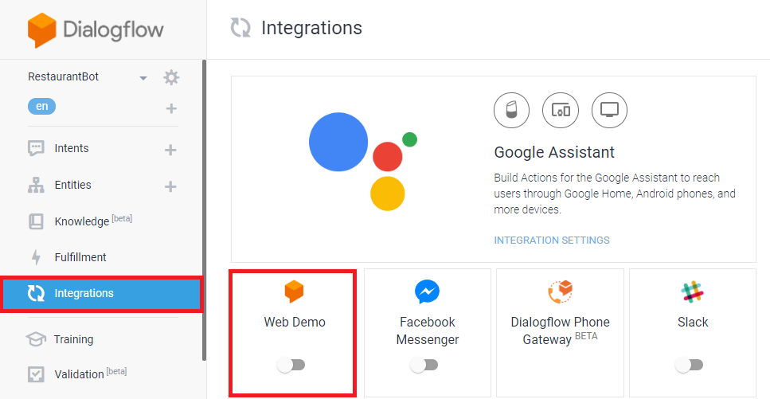

# Step 4: Web Integration

Dialogflow allows users to quickly test their chatbots and have made it easier to integrate it with a website. 

1.	Click on Integrations from the left panel.
2.	Then, click on toggle button of the Web Demo 

  

3. User the link to test your bot. If you want to integrate the bot on your website, use the iframe on your website.

  

