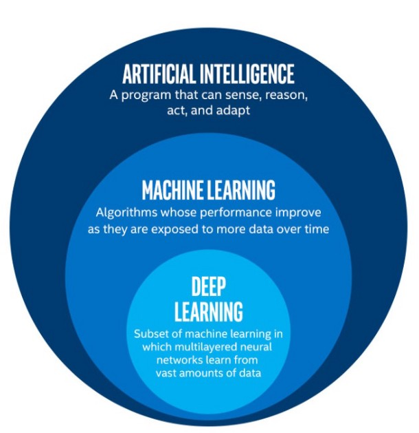

# Artificial Intelligence

## Quick Links

- [Books](#books)
- [Online Courses](#online-course)
- [Blogs to follow](#blogs-to-follow)
- [Popular AI/ML medium channel](#popular-ai/ml-medium-channel)
- [Popular Deep learning frameworks](#popular-deep-learning-frameworks)
- [Concepts](#concepts)
- [People to follow on Twitter](#people-to-follow-on-twitter)

## Books

- [Machine Learning For Dummies Hands On Machine Learning with Scikit Learn and TensorFlow](https://github.com/yanshengjia/ml-road/blob/master/resources/Hands%20On%20Machine%20Learning%20with%20Scikit%20Learn%20and%20TensorFlow.pdf)
- [Introduction to Statistical Learning](https://www-bcf.usc.edu/~gareth/ISL/ISLR%20Seventh%20Printing.pdf)
- [Practical Python and OpenCV + Case Studies](https://github.com/Shivanandroy/Study-Materials/blob/master/Practical%20Python%20and%20OpenCV%2C%203rd%20Edition.pdf)
- [Computer Vision: Models, Learning, and Inference](https://web.itu.edu.tr/hulyayalcin/Signal_Processing_Books/2010_Szeliski_ComputerVision.pdf)

## Online Courses

- [Deep Learning by NPTEL](https://nptel.ac.in/courses/106106184/)
- [A friendly introduction to Convolutional Neural Networks and Image Recognition](https://www.youtube.com/watch?v=2-Ol7ZB0MmU)
- [Coursera - Convolutional Neural Networks](https://www.coursera.org/learn/convolutional-neural-networks)
- [Collection | Convolutional Neural Networks for Visual Recognition (Spring 2017)](https://www.youtube.com/watch?v=vT1JzLTH4G4&list=PL3FW7Lu3i5JvHM8ljYj-zLfQRF3EO8sYv)
- [Udemy - Deep Learning and Computer Vision A-Z™ OpenCV, SSD & GANs](https://www.udemy.com/course/computer-vision-a-z/)
- [Udemy - Deep Learning: Advanced Computer Vision](https://www.udemy.com/advanced-computer-vision/?src=sac&kw=deep%20learning%3A%20advanced)

## Blogs to follow

- [Einstein AI](https://einstein.ai/research)
- [Google AI blog](https://ai.googleblog.com/)
- [WildML](http://www.wildml.com/)
- [DistillPub](https://distill.pub/) (distillpub is unique, blog and publication both)
- [Sebastian Ruder](http://ruder.io/)
- [Jack Clark](https://jack-clark.net/)

## Popular AI/ML medium channel

- [Towards data science](https://towardsdatascience.com/)
- [ML review](https://medium.com/mlreview)
- [Machine learning 101](https://medium.com/machine-learning-101)
- [Analytics vidhya](https://medium.com/analytics-vidhya)

## Popular Deep learning frameworks

- [Tensorflow](https://www.tensorflow.org/)
- [PyTorch](https://pytorch.org/)
- [Keras](https://keras.io/)
- [Caffe2](https://caffe2.ai/)

## Concepts

- Prerequisite :
  - Working knowledge of python.
  - Basic experience with [Numpy](https://colab.research.google.com/github/GokuMohandas/practicalAI/blob/master/notebooks/02_NumPy.ipynb) and [pandas](https://colab.research.google.com/github/GokuMohandas/practicalAI/blob/master/notebooks/03_Pandas.ipynb).
  - Understanding of [RegEx](https://www.analyticsvidhya.com/blog/2015/06/regular-expression-python/
  
## People to follow on Twitter

- [Siraj Raval](https://twitter.com/sirajraval)
- [Delip Rao](https://twitter.com/deliprao)
- [Geoffrey Hinton](https://twitter.com/geoffreyhinton)
- [Andrew NG](https://twitter.com/AndrewYNg)
- [Fermat's Library](https://twitter.com/fermatslibrary)
- [Samim](https://twitter.com/samim)
- [DynamicWebPaige](https://twitter.com/DynamicWebPaige)
- [Danilo J. Rezende](https://twitter.com/DeepSpiker)
- [Jane Wang](https://twitter.com/janexwang)
- [Lex Fridman](https://twitter.com/lexfridman)
- [Soumith chinthala](https://twitter.com/soumithchintala)
- [Jeremey Howard](https://twitter.com/jeremyphoward)
- [Hardmaru](https://twitter.com/hardmaru)

## AI vs ML vs Deep Learning

## What is Deep Learning ?

Just like we use our brains to identify patterns and classify various types of information, deep learning algorithms can be taught to accomplish the same tasks for machines.

   Example:
   Automatic car driving system is a good example of deep learning.

- Why Deep Learning now?

  Deep learning exits from 1970 but it became popular in the last 5 years due to the following reasons.
    - More availability of Data 
    - Cheaper storage devices
    - More computational power availability
    - More optimized algorithms which takes less power and utilizes less resources.

## What is Machine Learning?

Machine Learning is a subset of AI and these are the algorithms which can learn by themselves without being externally programmed.

Example:
Amazon using machine learning to give better product choice recommendations to there costumers based on their preferences.
Netflix uses machine learning to give better suggestions to their users of the Tv series or movie or shows that they would like to watch.

## What is Artificial Intelligence?

Artificial Intelligence is a ability of computer program to function like a human brain

Example: Robots like Sophia

## Use cases

- [Computer Vision](./Computer%20Vision)
- [Natural Language Processing](./Natural%20Langauge%20Processing)
