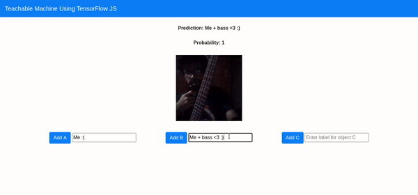

# 
Build a Teachable Machine using TensorFlow JS

 

  

*
Teachable Image Classifier: Live demo at https://navendu.me/teachable-machine
*

  

*
Teachable Audio Classifier: Live demo at https://editor.p5js.org/navendu-pottekkat/present/NggxLAXXM
*

# 
What is a Teachable Machine?

A Teachable Machine is a web-based tool that makes training a Machine Learning model fast, easy and accessible to everyone.

In this project, we will be building a Teachable Machine that lets anyone teach their computer to recognize images using their webcam.

We will look into TensorFlow JS, a JavaScript library developed by Google for training and using Machine Learning models in the browser and use it to create our own Machine Learning model.

By the end of the project, we will have built a Teachable Machine that runs in your browser and can be hosted on the Internet.

# 
What will you learn?

* TensorFlow and TensorFlow JS, one of the most popular libraries for Machine Learning.
* How Computer Vision works and how you can create a Computer Vision model.
* Leveraging the power of pre-trained state-of-the-art models using Transfer Learning.
* Deploying Deep Learning models on edge(web browser).
* Learn to collaboratively work on an open-source project using version control system(Git)
* This project will enable you to build cool Computer Vision projects in Tensorflow.js.
* Participating in this project will qualify you to join our intermediate and advanced projects on the same technology.

# 
Requirements

* Basic knowledge of Machine Learning, Computer Vision and Deep Learning. (Hands-on experience in TensorFlow preferred)
* Basic JavaScript and HTML(enough to read and understand HTML code) programming knowledge.
* Familiarity with version control tools. (GitHub)
* Smart enough to find a solution on the internet(Stackoverflow, GitHub issues etc).

# 
Time requirement

Should be able to spend minimum 2 hours on weekdays and a minimum of 5 hours on weekends

# 
Suggested reading

* Haven’t tried a Teachable Machine? Check out [one built by Google](https://teachablemachine.withgoogle.com/).
* If you do not have any knowledge of HTML, try building a basic website from this [tutorial](https://www.yourhtmlsource.com/myfirstsite/myfirstpage.html).
* If you do not have experience with TensorFlow or Machine Learning, check out [Hello World- for Machine Learning](https://towardsdatascience.com/hello-world-for-machine-learning-4dc9af0a7430).
* If you are new to Computer Vision and have no idea about Convolutional Neural Networks, go through these articles even just to refresh your memory.
    * [Getting started with Computer Vision](https://towardsdatascience.com/classifying-fashion-apparel-getting-started-with-computer-vision-271aaf1baf0).
    * [Getting started with Convolutional Neural Networks](https://towardsdatascience.com/classifying-fashion-apparel-getting-started-with-convolutional-neural-networks-3ae4fc5d9f76).

# 
Course Outline

## 
Phase 1- Creating the web interface using HTML (2 Hours)

We will start the project by first creating the front-end web page interface for the Teachable Classifier.

We will create a basic web page which we can connect with the brain of our project, which we will build in the coming weeks.

## 
Phase 2- Creating the “brain” with TensorFlow JS (3 Hours)

We will now create the Machine Learning model that powers this project. 

We will start by loading a pre-trained Convolutional Neural Network and connect it with the web interface that we have created in the previous step. 

We will then see how we can use the webcam to capture images and perform inference on them using our loaded model in real-time.

## 
Phase 3- Deploying the Teachable Machine (2 Hours)

We will finally deploy our Teachable Machine on GitHub for the whole World to see.

We will talk about the next steps and see how we can improve the project by adding more features.

## 
Phase 4- Save and reuse the trained model and further improvements (3 Hours)

We will now save the model from our Teachable Machine so that we can use it for other projects.

We will learn how to save and load models on TensorFlow JS.

## 
Furthur Improvements

* Add more teachable models using [PoseNet](https://github.com/tensorflow/tfjs-models/tree/master/posenet)

# 
Post-course benefits

- Get your GitHub reviewed by experts.
- Once you have undertaken and completed the project, you will get full-fledged support from our mentors from the community for any technical help, guidance, etc.
- As most of the companies prefer giving assignments to the candidate for a DL role, we can help you to mentor for the same.
- As we have mentored and we know your skills and achievement, we will refer you for any AI/ML job which fits your profile.
- As we know LinkedIn is the platform to catch recruiters' attention, we will shout out your achievements, help to boost your work on LinkedIn to get visibility.
- Since the project timelines are fixed, you will have to submit the assigned tasks and work within a given time.
- Please join the project based on your available bandwidth. Project fees are non-refundable.
- Classes will mostly be held during the weekends (Saturday, Sunday) for 2-3 hours per day.
- This project does not provide any certificate. Only certificates won't give you a job. Knowledge and projects will. That is what we primarily focus on Hands-on projects.

# 
How to apply?

If you feel you are qualified and fit the requirements mentioned above, please send your profile (Resume, LinkedIn, GitHub) to colearninglounge@gmail.com with the subject line **Project-based project learning | CV | Teachable Machine**
- Why do you want to join this project?
- What are your expectations for this project?

# 
Training period fee - ₹ 1999/- per person

- The project starts on **_23rd Aug 2020_** till completion of the project OR **_27th September 2020._** Whichever comes first.
- To maintain the quality of learning maximum of **10 people** in the batch is allowed.

The last day to apply is **_19th Aug 2020._**

For any query email us to colearninglounge@gmail.com.

# 
Scholarship opportunity

During the span of the course, if you help us in creating content (learning material) for the course, then based on your contribution we will return the fees.

#### 
It's our sole decision about contribution and reward.

